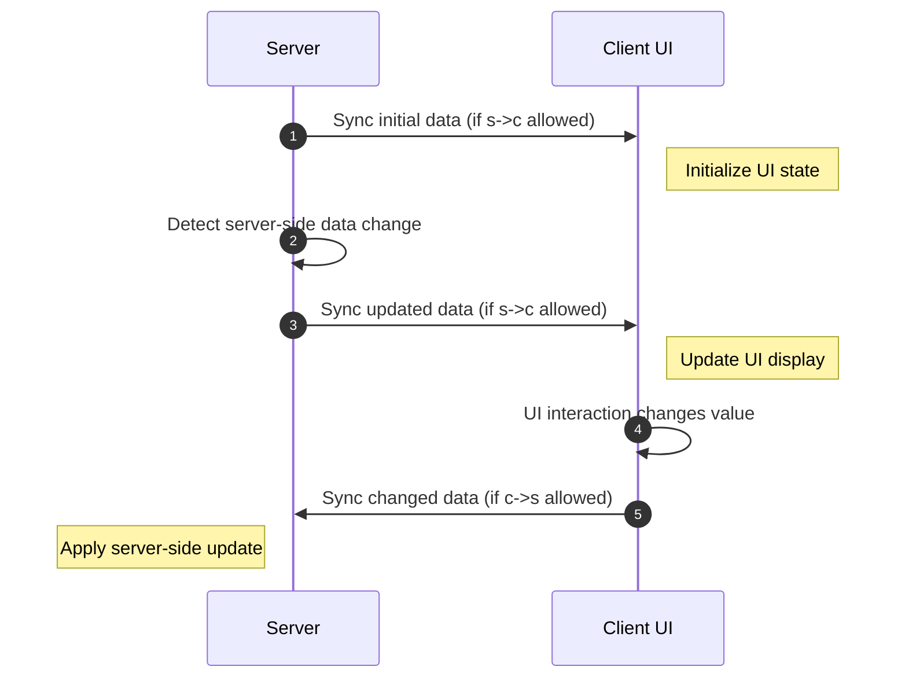

# Data Bindings and RPCEvent

{{ version_badge("2.1.5", label="Since", icon="tag") }}

Before learning **Data Bindings** and **RPCEvent**, it is important to understand  
the relationship between **UI components** and **data**.

---

## Data bindings on the client side

If a UI component is data-driven, its role in the data model usually falls into one of the following categories:

- **Data consumer**: passively receives data and renders it.
- **Data producer**: produces data that may change (pure producers are rare in practice).
- **Data consumer + producer**: both displays data and modifies it.


### **Data consumer** with `IDataConsumer<T>`

Components that **passively receive data** implement the `IDataConsumer<T>` interface,  
such as `Label` and `ProgressBar`.

This interface allows you to bind an `IDataProvider<T>`,  
which is responsible for **supplying updated data values**.

This is useful when you want to display **dynamic text** or **changing progress values**.


=== "Java"

    ```java
    var valueHolder = new AtomicInteger(0);
    // bind a DataSource to notify the value changes for label and progress bar
    new Label().bindDataSource(SupplierDataSource.of(() -> 
        Component.literal("Binding: ").append(String.valueOf(valueHolder.get())))),
    new ProgressBar()
            .bindDataSource(SupplierDataSource.of(() -> valueHolder.get() / 100f))
            .label(label -> label.bindDataSource(SupplierDataSource.of(() -> 
                Component.literal("Progress: ").append(String.valueOf(valueHolder.get())))))
    ```

=== "KubeJS"
   
    ```js
    let valueHolder = {
        "value": 0
    }
    // bind a DataSource to notify the value changes for label and progress bar
    new Label().bindDataSource(SupplierDataSource.of(() => `Binding: ${valueHolder.value}`)),
    new ProgressBar()
        .bindDataSource(SupplierDataSource.of(() => valueHolder.value / 100))
        .label(label => label.bindDataSource(SupplierDataSource.of(() => `Progress: ${valueHolder.value}`)))
    ```

### **Data producer** with `IObservable<T>`
Components that produce changeable data implement the `IObservable<T>` interface.
Most data-driven components fall into this category, such as `Toggle`, `TextField`, `Selector`

This interface allows you to bind an `IObserver<T>`,
which is notified whenever the component’s value changes.

For example, to observe changes from a `TextField`:

=== "Java"

    ```java
    var valueHolder = new AtomicInteger(0);
    // bind a Observer to observe the value changes of the text-field
    new TextField()
        .setNumbersOnlyInt(0, 100)
        .setValue(String.valueOf(valueHolder.get()))
        // bind an Observer to update the value holder
        .bindObserver(value -> valueHolder.set(Integer.parseInt(value)))
        // actually, equal to setTextResponder
        //.setTextResponder(value -> valueHolder.set(Integer.parseInt(value)))
    ```

=== "KubeJS"
   
    ```js
    let valueHolder = {
        "value": 0
    }
    // bind a Observer to observe the value changes of the text-field
    new TextField()
        .setNumbersOnlyInt(0, 100)
        .setValue(valueHolder.value)
        // bind an Observer to update the value holder
        .bindObserver(value => valueHolder.value = int(value))
        // actually, equal to setTextResponder
        //.setTextResponder(value => valueHolder.value = int(value))
    ```

!!! note
    Components such as `Toggle`, `Selector`, and `TextField` support both
    `IDataConsumer<T>` and `IObservable<T>`,
    because they are responsible for displaying data and modifying it at the same time.

---

## Data Bindings Between Client and Server

If your UI works **only on the client**, `IDataConsumer<T>` and `IObservable<T>` are usually sufficient.  
They cover most needs for observing and updating local data.

However, many UIs are **container-based UIs**, where the actual data is stored on the **server**.  
In this case, you typically want:

- To **display server-side data** in client UI components.
- To **sync changes made on the client UI back to the server**.

This is known as **bidirectional data binding**



This may sound complex, but LDLib2 fully abstracts this process. 

---

### Using `DataBindingBuilder<T>`

With `DataBindingBuilder<T>`, you **do not need to write any synchronization logic yourself**.
You only describe:

* **Where the data is stored**
* **How to read it**
* **How to apply updates**

#### Simple Bidirectional Binding

=== "Java"

    ```java
    // Server-side values
    // boolean bool = true;
    // String string = "hello";
    // ItemStack item = new ItemStack(Items.APPLE);

    new Switch()
        .bind(DataBindingBuilder.bool(() -> bool, value -> bool = value).build());

    new TextField()
        .bind(DataBindingBuilder.string(() -> string, value -> string = value).build());

    new ItemSlot()
        .bind(DataBindingBuilder.itemStack(() -> item, stack -> item = stack).build());
    ```

=== "KubeJS"

    ```js
    // Server-side values
    // let bool = true;
    // let string = "hello";
    // let item = new ItemStack(Items.APPLE);

    new Switch()
        .bind(DataBindingBuilder.bool(() => bool, v => bool = v).build());

    new TextField()
        .bind(DataBindingBuilder.string(() => string, v => string = v).build());

    new ItemSlot()
        .bind(DataBindingBuilder.itemStack(() => item, v => item = v).build());
    ```

For example, in:

```java
DataBindingBuilder.bool(() -> bool, value -> bool = value).build()
```

* The **first lambda** defines how the server provides data to the client.
* The **second lambda** defines how client changes update server data.

---

### One-Way Binding (Server → Client Only)

Sometimes, you **do not want client-side changes to affect the server**,
such as with `Label`, which is display-only.

LDLib2 allows you to explicitly control sync strategies.

??? info "SyncStrategy Overview"
    - `NONE`
    No synchronization at all.
    - `CHANGED_PERIODIC`
    Sync only when data changes (default: once per tick).
    - `ALWAYS`
    Force sync every tick, even if unchanged (use with caution).

=== "Java"

    ```java
    // Block client -> server updates
    new Label().bind(
        DataBindingBuilder.component(() -> Component.literal(data), c -> {})
            .c2sStrategy(SyncStrategy.NONE)
            .build()
    );

    // Shorthand for server -> client only
    new Label().bind(
        DataBindingBuilder.componentS2C(() -> Component.literal(data)).build()
    );
    ```

=== "KubeJS"

    ```js
    // Block client -> server updates
    new Label().bind(
        DataBindingBuilder.component(() => data, c => {})
            .c2sStrategy("NONE")
            .build()
    );

    // Shorthand for server -> client only
    new Label().bind(
        DataBindingBuilder.componentS2C(() => data).build()
    );
    ```

---

### Custom `IBinding<T>`

`DataBindingBuilder<T>` provides built-in bindings for common data types.
For custom types (for example, `int[]`), you can create your own binding.

```java
// Server-side value
// int[] data = new int[]{1, 2, 3};

new BindableValue<int[]>().bind(
    DataBindingBuilder.create(
        () -> data,
        v -> data = v
    ).build()
);
```

!!! warning inline end
    Not all types are supported by default.
    See [Type Support](../../sync/types_support.md){ data-preview }.
    Unsupported types require a custom type accessor.

If a type is **read-only** (see [Type Support](../../sync/types_support.md){ data-preview }):

* The getter **must return a stable, non-null instance**.
* You have to define the type and initial value.

Example with `INBTSerializable`:

```java
// Server-side value
// INBTSerializable<CompoundTag> data = ...;

new BindableValue<INBTSerializable>().bind(
    DataBindingBuilder.create(
        () -> data,
        v -> {
            // Instance already updated, just react here
        }
    )
    .initialValue(data).syncType(INBTSerializable.class)
    .build()
);
```

This ensures correct synchronization and avoids ambiguity for read-only objects.

### `Getter` and `Setter` on the client
You may be wondering why we only define getter and setter logic on the server side, but not on the client side.

This is because all components that support the bind method inherit from `IBindable<T>`.
For these components, LDLib2 automatically sets up the corresponding client-side getter and setter logic for data synchronization.

In most cases, this default behavior is sufficient and requires no additional configuration.

However, if you want full control over how the client processes incoming data, or what data it sends back to the server, you can manually define your own client-side getter and setter logic.

=== "Java"

    ```java
    // Server-side value
    // Block data = ...;

    var label = new Label();
    new BindableValue<Block>().bind(
        DataBindingBuilder.blockS2C(() -> data)
            .remoteSetter(block -> label.setText(block.getDescriptionId())).build()
    );
    ```
=== "KubeJS"

    ```js
    // Server-side value
    // Block data = ...;

    let label = new Label();
    new BindableValue().bind(
        DataBindingBuilder.blockS2C(() => data)
            .remoteSetter(block => label.setText(block.getDescriptionId())).build()
    );
    ```

### All in one - `BindableUIElement<T>`
You may have already noticed that almost all data-driven components—such as `TextArea`, `SearchComponent`, `Switch`, and others—are built on top of `BindableUIElement<T>`.
`BindableUIElement<T>` is a wrapped UI element that implements all of the following interfaces:
This means it can both **display data** and **produce data changes**, while supporting **client–server synchronization**.

??? info inline end
    `BindableValue<T>` is actually a utill component, and set `dispaly: CONTENTS;`, which means it wont affect layout during it';s lifestyle.

If you want to implement your own UI component and support bidirectional data binding between the client and server, you can simply extend this class.
For components that do **not** implement `IBindable<T>`—such as the base `UIElement`—you can still achieve data bindings by attaching a `BindableValue<T>` internally.
The example below shows how to sync server-side data to the client and use it to control an element’s width:

=== "Java"

    ```java
    // Server-side value
    // var widthOnTheServer = 100f;

    var element = new UIElement();
    element.addChildren(
        new BindableValue<Float>().bind(DataBindingBuilder.floatS2C(() -> widthOnTheServer)
            .remoteSetter(width -> element.getLayout().width(width))
            .build())
    );
    ```
=== "KubeJS"

    ```js
    // Server-side value
    // let widthOnTheServer = 100;

    let element = new UIElement();
    element.addChildren(
        new BindableValue().bind(DataBindingBuilder.floatS2C(() => widthOnTheServer)
            .remoteSetter(width => element.getLayout().width(width))
            .build())
    );
    ```

### Complex usage examples

Ok, let's do one more complicated exmaple, let's bind a list of `String` stored at the server for a `Selector` (as candidates ).
```java
// method 1, we sync String[]
// represent value stored on the server
// var candidates = new ArrayList<>(List.of("a", "b", "c", "d"));

var selector1 = new Selector<String>();
selector1.addChild(
    // a placeholder element value to sync candidates, it won't affect layout
    new BindableValue<String[]>().bind(DataBindingBuilder.create(
            () -> candidates.toArray(String[]::new), Consumers.nop())
            .c2sStrategy(SyncStrategy.NONE) // only s -> c
            .remoteSetter(candidates -> {
                selector1.setCandidates(Arrays.stream(candidates).toList());
            })
            .build()
    )
);

// method 2, we sync List<String>
// represent value stored on the server and client
// var candidates = new ArrayList<>(List.of("a", "b", "c", "d"));

var selector2 = new Selector<String>();
// because the List is a readonly value for ldlib2 sync system. you have to obtain the real type of List<String>
Type type = new TypeToken<List<String>>(){}.getType();
selector2.addChild(
    // a placeholder element value to sync candidates, it won't affect layout
    new BindableValue<List<String>>().bind(DataBindingBuilder.create(
            () -> candidates, Consumers.nop())
            .syncType(type)
            .initialValue(candidates)
            .c2sStrategy(SyncStrategy.NONE) // only s -> c
            .remoteSetter(selector2::setCandidates)
            .build()
    )
);

root.addChildren(selector1, selector2);
```
If you understand the two approaches shown in this code, you have essentially mastered data binding.

- **Method 1** synchronizes a `String[]`, which is straightforward and works as expected.
- **Method 2** synchronizes a `List<String>`. Since `Collection<T>` is treated as a **read-only type** in LDLib2, you must explicitly provide an `initialValue` and specify the actual type (including generics).

This ensures the binding system can correctly identify and track the data.


---

## UI RPCEvent
At first glance, the data binding system seems to handle most synchronization needs, but in practice, this is not always the case.

For example, if you want to execute server-side logic when a user clicks a button, data bindings are clearly not suitable.

Now consider a more complex scenario: binding a `FluidSlot` to a server-side `IFluidHandler`.
This may appear possible with data bindings. If it is used only for server-to-client display, it works fine.
However, once interaction is involved, bidirectional synchronization becomes dangerous.

If the client is allowed to modify the value, it can easily send malicious packets to manipulate the server-side `IFluidHandler`.

??? "The correct approach is"
    * Use **server-to-client** data bindings for display only
    * Send **client interactions** (such as clicking a `FluidSlot`) to the server
    * Handle the interaction on the server
    * If the server state changes, synchronize it back to the client via data bindings

In short, we need a mechanism to send interaction data between client and server.
This mechanism is called **`UI RPCEvent`**.

Taking a button as an example, if you have read the [UI Event](./event.md#register-event-listeners) section, you already know that UI events can be sent to the server and trigger logic.
Internally, this is implemented using `RPCEvent`.

```java
// trigger ui event on the server
var button = new UIElement().addServerEventListener(UIEvents.MOUSE_DOWN, e -> {
    // do something on the server
});
```

```java
// equivalent implementation using RPCEvent

var clickEvent = RPCEventBuilder.simple(UIEvent.class, event -> {
    // do something on the server
});

new UIElement().addEventListener(UIEvents.MOUSE_DOWN, e -> {
    e.currentElement.sendEvent(clickEvent, e);
}).addRPCEvent(clickEvent);
```

You can use `RPCEventBuilder` to construct an `RPCEvent` and send data to the server when needed.

!!! note
    When sending RPC events, **the parameters passed to `sendEvent` must exactly match the parameters defined in the `RPCEventBuilder`**, including their order and types, and don't forget to `addRPCEvent` them. 
    Otherwise, the event will not be dispatched correctly.


### RPCEvent with return
Sometimes you may want to send a request to the server to query data, and expect the server to return a result.
For example, to ask the server to perform an addition and return the result, you can define it like this:

```java
var queryAdd = RPCEventBuilder.simple(int.class, int.class, int.class, (a, b) -> {
    // calculate the result and return on the server
    return a + b;
});

new UIElement().addEventListener(UIEvents.MOUSE_DOWN, e -> {
    e.currentElement.<Integer>sendEvent(queryAdd, result -> {
        // receive the result on the client
        assert result == 2;
    }, 1, 2);
}).addRPCEvent(queryAdd);
```

### Send event to the client
In practice, **UI RPC events are designed primarily for client → server communication**, with optional responses sent back to the client.  
This matches most real-world use cases, where the **server owns the data and logic**, and the client only sends interaction requests.

LDLib2 therefore does **not** provide a dedicated UI-level API for server → client RPC events.

However, **if you really need to actively send events from the server to the client**, you can achieve this by using the generic [RPC Packet](../../sync/rpc_packet.md) system.

Below is an example showing how the server sends an RPC packet to clients, and how the client locates and operates on a specific UI element.

```java
var element = new UIElement().setId("my_element");

// annotate your packet method anywhere you want
@RPCPacket("rpcEventToClient")
public static void rpcPacketTest(RPCSender sender, String message, boolean message2) {
    if (sender.isRemote()) {
        var player = Minecraft.getInstance().player;
        if (player != null && player.containerMenu instanceof IModularUIHolderMenu uiHolderMenu) {
            uiHolderMenu.getModularUI().select("#my_element").findFirst().ifPresent(element -> {
                // do something on the client side with your element.
            });
        } 
    }
}

// send pacet to the remote/server 
RPCPacketDistributor.rpcToAllPlayers("rpcEventToClient", "Hello from server!", false)
```

This approach gives you full control over server-initiated client logic, while keeping the UI RPC system simple and focused on interaction-driven workflows.

!!! tip
    When using **`FluidSlot`** with container bindings, the implementation already uses  
    **server → client (s→c) read-only data syncing** combined with **RPC events** for interactions.

    You don’t need to handle sync strategies yourself.  
    The `FluidSlot.bind(...)` implementation is also a good reference for learning how data syncing and RPC-based interactions work together.
