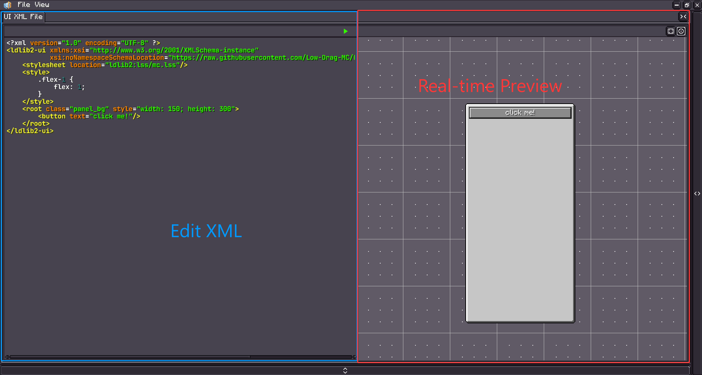

# UI Editor

{{ version_badge("2.1.5", label="Since", icon="tag") }}

!!! warning inline end
    This command can only be used under the `single player` world.

LDLib2 provides a visual editor to support UI creatiom. Use command to open the UI Editor.

```shell
/ldlib2_ui_editor
```

<figure markdown="span">
  { width="80%" }
</figure>

The UI Editor supports two ways of creating UIs through visualization:

* `UI XML`
* `UI Template`

---

## UI XML

Click **`File → New → UI XML File`** to create a new UI XML file.  
You can also click **`Open`** to load an existing XML file.

<figure markdown="span">
  { width="80%" }
</figure>

<figure markdown="span">
  { width="80%" }
</figure>

Once opened, you can edit the XML and see a **real-time preview** of your UI directly in the editor. For more xml details, check [UI Xml](./xml.md){ data-preview }

!!! tip
    You can also edit the XML file using an external IDE (such as VS Code or IntelliJ IDEA).  
    The preview will automatically update when you save your changes.

---

## UI Template

A **UI Template** is similar to **UI XML** and is used to define UI content  
(including **styles** and the **component tree**).

The key differences are:

- UI Templates can be **edited visually** using the **UI Editor**.
- A saved UI Template can be reused as a **template component** in other **UI XML** files or **UI Templates**.

Unlike UI XML files, **UI Templates are managed by LDLib2’s resource system**.  
To create one, use the **Resource Panel**:

<figure markdown="span">
  { width="100%" }
</figure>

**Steps:**

1. Select the **UI** resource category.
2. Choose or create a **resource provider**.
3. Right-click and create a **UI Template**, then double-click it to enter edit mode.

### Edit your Template

After opening a UI Template, you will see the following editor interface:

<figure markdown="span">
  { width="100%" }
</figure>

1. **Style Configurator**  
   Edit built-in styles, add or remove external stylesheets, and inspect applied styles.

2. **UI Tree**  
   Displays the full UI hierarchy.  
   You can create or remove components via the context menu, select multiple elements, or drag to reorder the hierarchy.

3. **Element Configurator**  
   Shows configurable properties of the currently selected element.

4. **Preview**  
   Provides a real-time preview of your UI.

Using the UI Editor, you can configure **layout**, **styles**, and other settings visually.  
If you understand the concepts introduced in the *Preliminary* section, the editor should be intuitive to use.  
For components with special configuration options, refer to their individual documentation pages.

### Load UI Template and setup
There are two methods to load and use your template for your UI.

1. you could also move it to your assets and loaed it by a `ResourceLoaction`.
2. if the resrouce is under the ldlib2 folder, you can right click the resource to obtain the resource path and load it.

<figure markdown="span">
  { width="100%" }
</figure>

=== "Java"

    ```java
    @Override
    public ModularUI createUI(Player player) {
        var ui = Optional.ofNullable(UIResource.INSTANCE.getResourceInstance()
                // resource location based
                .getResource(new FilePath(ResourceLoaction.parse("ldlib2:resources/examples/example_layout.ui.nbt"))))

                // file based
                //.getResource(new FilePath(new File(LDLib2.getAssetsDir(), "ldlib2/resources/examples/example_layout.ui.nbt"))) // LDLib2.getAssetsDir() = ".minecraft/ldlib2/assets"

                .map(UITemplate::createUI)
                .orElseGet(UI::empty);

        // find elemetns and do data bindings or logic setup here
        var buttons = ui.select(".button_container > button").toList(); // by selector
        var container = ui.selectRegex("container").findFirst().orElseThrow(); // by id regex

        return ModularUI.of(ui, player);
    }
    ```

=== "KubeJS"

    ```js
    function createUIFromUIResource(path) {
        return UIResource.INSTANCE.getResourceInstance().getResource(path).createUI();
    }

    function createUI(player) {
        // file based
        let ui = createUIFromUIResource("file(./ldlib2/assets/ldlib2/resources/global/modern_styles.ui.nbt)")

        // resource location based
        // let ui = createUIFromUIResource("file(ldlib2:resources/global/modern_styles.ui.nbt)")

        // find elemetns and do data bindings or logic setup here
        let buttons = ui.select(".button_container > button").toList(); // by selector
        let container = ui.selectRegex("container").findFirst().orElseThrow(); // by id regex

        return ModularUI.of(ui, player)
    }
    ```

### Loading Event

A saved **UI Template** only defines the visual structure and styles — it does not include runtime logic by default.  
In most cases, you load the template and then manually attach handlers or bindings in code.

However, if you want to **reuse the same UI in different contexts**, repeating the same setup logic every time becomes tedious.

To address this, **LDLib2 provides a hook event** that lets you **inject logic when the UI Template calls `createUI()`**, so you can configure the returned `UI` automatically during creation.

```java
@SubscribeEvent
public static void onUICreated(UITemplate.CreateUI event) {
    var template = event.template;
    var ui = event.ui;
    // do initialization here
}
```

---

## UI Simulation

Click the **green Play button** at the top of the editor to enter **simulation mode**.  
This allows you to interact with the UI and verify its behavior.

<figure markdown="span">
  { width="100%" }
</figure>